# XMeta Console GUI User Manual

> Version: v3.1.1
> Last Updated: 2026-06-08

## Preface

XMeta Console GUI is a PyQt5 desktop operations console for EDA and chip-design execution runs. It helps users browse run directories, monitor target status, trace dependencies, inspect related files, edit runtime parameters, open terminals, and execute common target actions from one GUI.

This manual is written as a practical user guide. It follows the same broad style as IC Flow Platform manuals: first explain the environment and core concepts, then walk through the interface, common workflows, advanced modules, data files, and troubleshooting notes.

## Revision History

| Version | Date | Notes |
|---------|------|-------|
| v3.0.0 | 2026-03-19 | Main workflow consolidation, configurable buttons, configurable columns, and grouped target rows. |
| v3.1.0 | 2026-05-09 | Sidebar navigation, graph tab workflow, embedded terminal, automatic refresh pipeline, and generated PDF manual. |
| v3.1.1 | 2026-06-08 | Reworked the manual into a formal PDF-oriented user guide. |

## 1. Introduction

### 1.1 Purpose

XMeta Console GUI is built for engineers who need to inspect and operate run targets that already exist on disk. The application does not define a new flow language. It reads existing run artifacts and presents them through a focused desktop interface.

### 1.2 Main Capabilities

- Select a run and inspect its target hierarchy.
- Monitor target status, start time, and end time.
- Search, filter, and trace targets.
- Visualize dependencies in a read-only graph.
- Open target logs, shell scripts, command files, tune files, and params files.
- Edit BSUB queue, core count, and memory fields.
- Execute selected target actions from buttons or context menus.
- Track filesystem changes and refresh the GUI automatically.

### 1.3 Target Users

This manual is intended for:

- Flow users who need to monitor and operate EDA runs.
- CAD or methodology engineers who maintain run structure and target metadata.
- Developers who need a high-level map of the GUI modules before changing code.

## 2. Environment And Startup

### 2.1 Runtime Requirements

Recommended runtime:

```bash
python3 --version
```

The application expects Python 3.10 or newer and PyQt5.

Primary Python dependency:

```bash
python3 -m pip install PyQt5
```

Optional tools:

- `gvim` for opening tune files.
- `xterm` for embedded terminal support on Linux/X11.
- A desktop terminal application for external terminal fallback.

### 2.2 Repository Layout

Expected project layout:

```text
<repo root>/
+-- new_gui/
|   +-- main.py
|   +-- application/
|   +-- infrastructure/
|   +-- model/
|   +-- presentation/
|   +-- shared/
+-- docs/
+-- tests/
+-- tools/
+-- README.md
+-- AGENTS.md
```

### 2.3 Start The GUI

Launch from the repository root:

```bash
python3 new_gui/main.py
```

After startup:

1. Choose or confirm the run base directory.
2. Select a run from the run selector.
3. Wait for target dependency and status information to load.
4. Use the main tree, sidebar, graph, context menu, and bottom output panel for daily work.

## 3. Run Directory Model

### 3.1 Typical Run Directory

XMeta Console GUI expects a run directory with flow-generated files:

```text
<run_dir>/
+-- .target_dependency.csh
+-- status/
+-- logs/
|   +-- targettracker/
+-- make_targets/
+-- tune/
+-- user.params
+-- tile.params
```

### 3.2 Important Files

| File Or Directory | Role |
|-------------------|------|
| `.target_dependency.csh` | Defines active targets, levels, dependency edges, and related target groups. |
| `status/{target}.{status}` | Provides target runtime status. |
| `logs/targettracker/{target}.start` | Provides target start timestamp information. |
| `logs/targettracker/{target}.finished` | Provides target finish timestamp information. |
| `make_targets/{target}.csh` | Stores target shell scripts and editable BSUB parameters. |
| `tune/{target}/{target}.{suffix}.tcl` | Stores target-specific tune files. |
| `user.params` | Stores editable user parameters. |
| `tile.params` | Stores read-only generated parameters. |

### 3.3 Basic Concepts

| Concept | Meaning |
|---------|---------|
| Run | A filesystem workspace containing target status, dependency, log, tune, params, command, and shell files. |
| Target | A named EDA task inside a run. |
| Level | The target's level in the parsed dependency hierarchy. |
| Status | The latest runtime state inferred from files under the run status directory. |
| Tune | One or more target-specific TCL files used to configure execution behavior. |
| Dependency Graph | A read-only visual graph for target dependency inspection and navigation. |
| Sidebar Category | A stage or type grouping used to narrow the visible target set. |

## 4. Main Interface Overview

### 4.1 Interface Areas

The main window is composed of these areas:

- Top control panel.
- Run selector and action buttons.
- Left workspace sidebar.
- Main target tree view.
- Embedded dependency graph view.
- Bottom output and terminal area.
- Menu bar and shortcuts.
- Toast-style notifications.

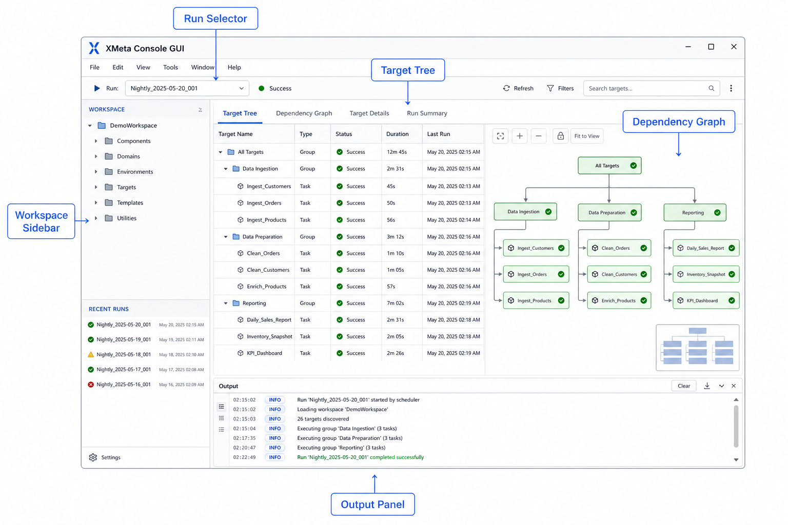

### 4.2 Main Workflow

A common workflow is:

1. Select a run.
2. Browse targets in the main tree.
3. Search, filter, or trace a target set.
4. Switch to dependency graph view when relationship shape matters.
5. Open related files, tune files, or parameter files.
6. Run actions and inspect output.
7. Monitor automatic refresh behavior when files change on disk.

## 5. Run Selection And Refresh

### 5.1 Purpose

Run selection controls which run directory is active. Most views, actions, and file lookups depend on the selected run.

### 5.2 Capabilities

- Detect the active run base directory.
- List available runs in the run selector.
- Keep a missing selected run visible when it disappears from disk.
- Refresh run availability without forcing an invalid selection.
- Rebuild cached target data when the selected run changes.

### 5.3 User Operations

1. Open the run dropdown.
2. Select the desired run.
3. Wait for the tree view to rebuild.
4. Use refresh if a new run appears while the GUI is open.

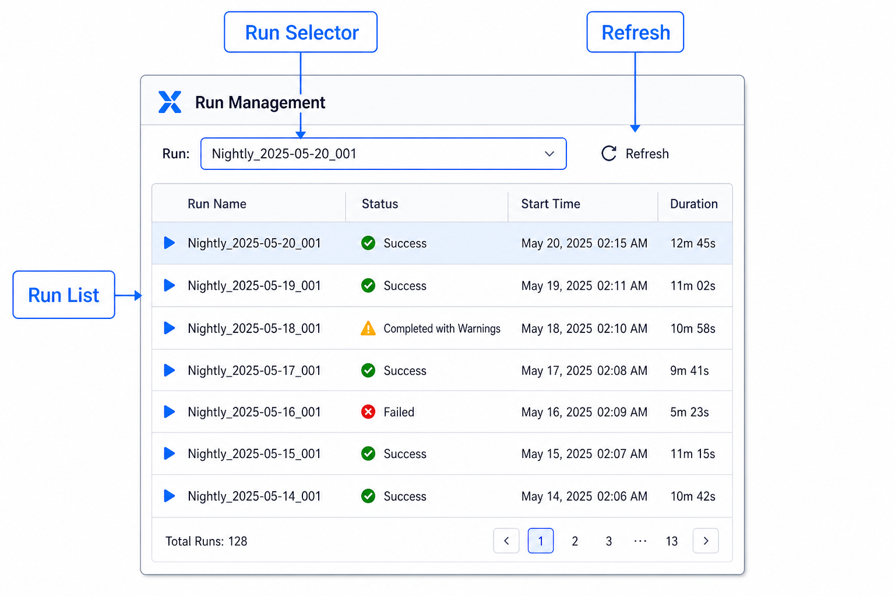

## 6. Main Target Tree View

### 6.1 Purpose

The main tree is the center of the application. It shows level-based targets and grouped targets parsed from `.target_dependency.csh`.

### 6.2 Displayed Columns

The tree can display:

- Level.
- Target.
- Status.
- Tune.
- Start Time.
- End Time.
- Queue.
- Cores.
- Memory.

The `level` and `target` columns are always visible.

### 6.3 Capabilities

- Show level rows, target rows, status, and timestamps.
- Show synthetic group rows for large generic target collections.
- Preserve expansion and scroll state across refreshes.
- Rebuild structural rows when dependency files change.
- Update status rows efficiently when only runtime status changes.

### 6.4 Tree Operations

- Expand all rows.
- Collapse all rows.
- Select one or more targets.
- Use right-click context menus for execution and file actions.
- Locate a graph-selected target back in the tree.

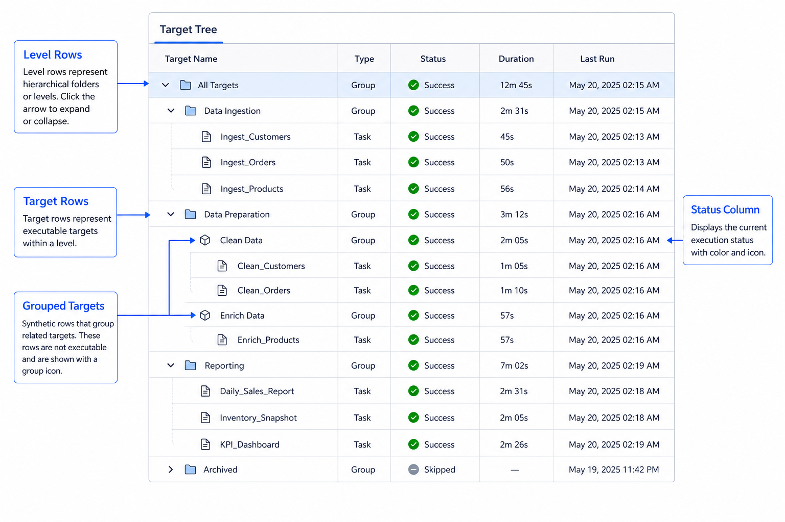

## 7. Search, Filtering, And Trace Views

### 7.1 Search

The header search field filters targets by name. Search is useful when the run contains many levels or generic target groups.

Search behavior:

- Filters target names as the user types.
- Preserves enough context to keep results readable.
- Restores the previous view when the search view is closed.

### 7.2 Status Filtering

Status views isolate groups such as failed, running, pending, or finished targets. This helps users focus on the current operation state instead of scanning the full run.

### 7.3 Trace Views

Trace views answer dependency questions:

- Trace Up shows upstream dependencies.
- Trace Down shows downstream dependencies.
- Filtered trace views preserve pre-trace selection and scroll context where possible.

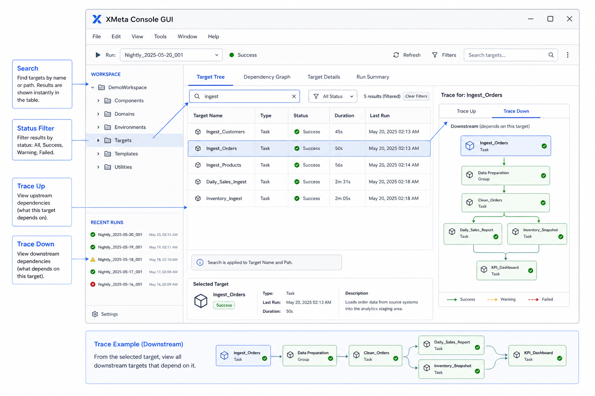

## 8. Workspace Sidebar And Category Navigation

### 8.1 Purpose

The left workspace sidebar provides category-based navigation and a content-mode switch surface.

### 8.2 Capabilities

- Toggle sidebar visibility.
- Filter targets by stage or type category.
- Switch between category overlay states.
- Preserve and restore sidebar selection when switching between main and graph content modes.
- Close category overlays and restore the prior view state.

### 8.3 Category Behavior

- Stage category filtering.
- Type category filtering.
- Graph-originated category overlays.
- Return to the previous tab state after closing an overlay.

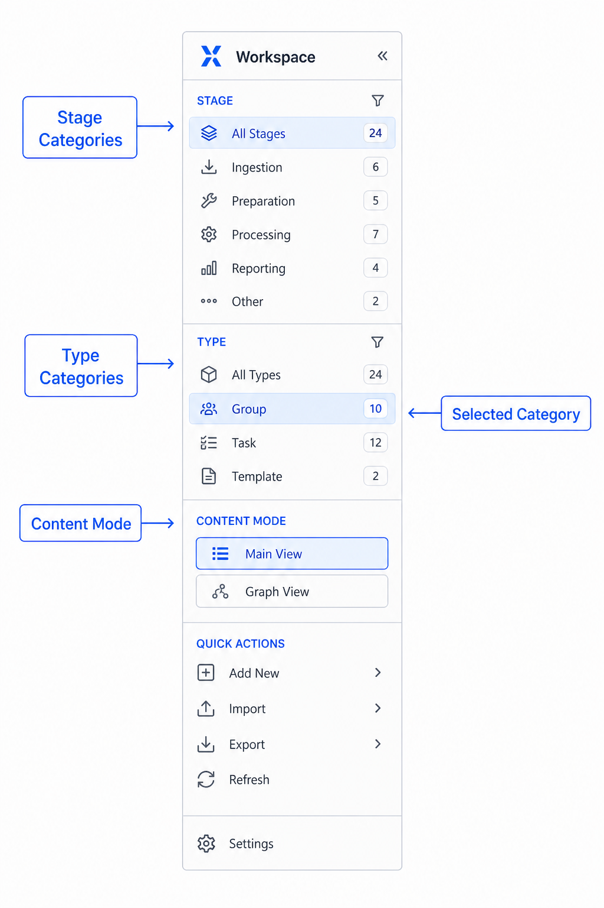

## 9. Dependency Graph View

### 9.1 Purpose

The dependency graph provides a visual representation of target relationships for the selected run. It is designed for inspection and navigation, not graph editing.

### 9.2 Capabilities

- Open dependency graph from menu, shortcut, or top tab.
- Lazy-load the graph panel.
- Reuse the graph panel until dependency data becomes dirty.
- Rebuild graph data when dependency files change.
- Highlight upstream and downstream paths.
- Select a node and map it back to a tree target.
- Support grouped graph nodes for synthetic target collections.

### 9.3 Interactions

- Zoom and pan.
- Search within the graph.
- Focus local subgraphs.
- Trace upstream and downstream from current selection.
- Return selected graph nodes to the tree view.
- Export graph images to PNG.

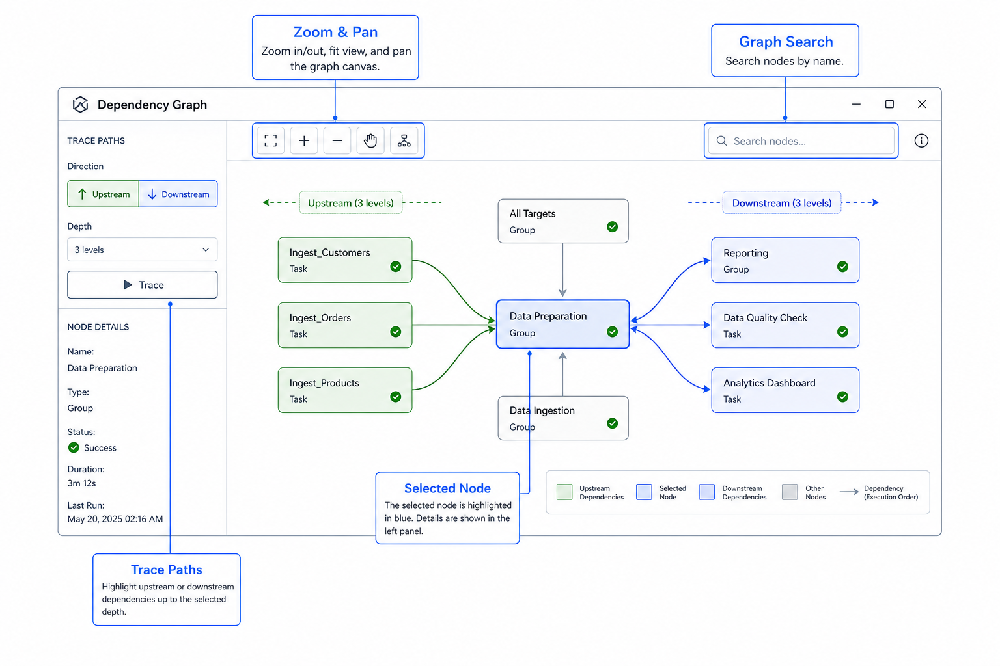

## 10. Execution And Context Menus

### 10.1 Execution Actions

Execution actions are available from top buttons and context menus:

- Run all.
- Run selected.
- Stop.
- Skip.
- Unskip.
- Invalid.

Some actions can operate on multiple selected targets.

### 10.2 Context Menu Areas

Right-click a target to access organized actions:

- Execute.
- Files.
- Tune.
- Params.
- Trace.
- Copy.

### 10.3 File Actions

Common file actions include:

- Open terminal in the current run.
- Open target shell script.
- Open log file.
- Open command file.
- Open tune files.
- Copy tune files to other runs.
- Open user params.
- Open tile params.

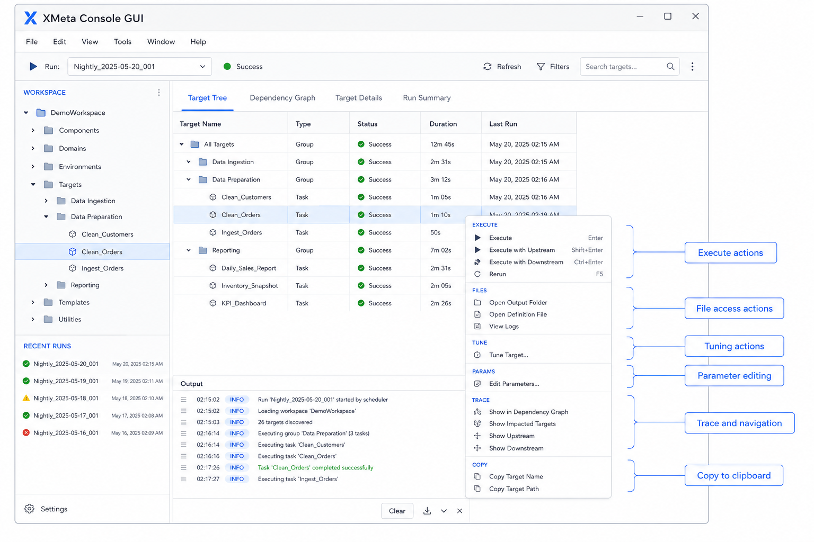

## 11. Tune Files And BSUB Parameter Editing

### 11.1 Tune Files

Tune files are discovered per target from the run's `tune/` directory.

Typical naming pattern:

```text
{run_dir}/tune/{target}/{target}.{suffix}.tcl
```

Tune operations:

- Discover tune files per target.
- Open tune files.
- Copy tune files to other runs.
- Refresh tune availability when files change on disk.

### 11.2 BSUB Parameters

BSUB parameter editing is available from editable tree columns:

- Queue maps to `-q`.
- Cores maps to `-n`.
- Memory maps to `rusage[mem=...]`.

The GUI edits one BSUB parameter at a time and invalidates cached BSUB values after a successful save.

### 11.3 Parameter File Tools

Parameter tools support:

- Open or create `user.params`.
- View `tile.params`.
- Search large params files.
- Back up `user.params` before saving edits.
- Show notifications for missing files or creation success.

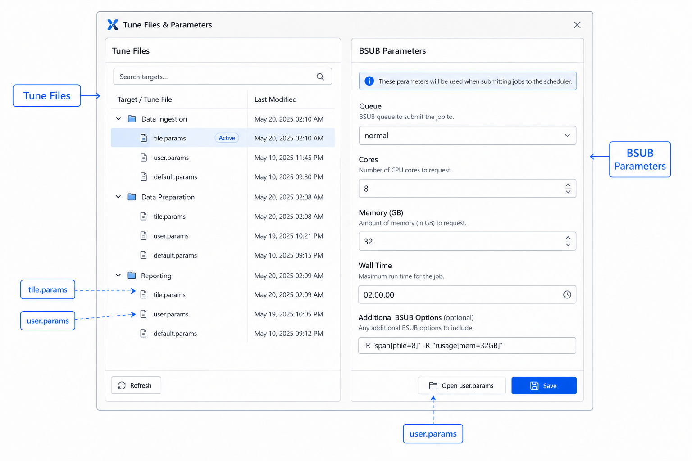

## 12. Embedded Terminal And External Terminal

### 12.1 Embedded Terminal

The embedded terminal panel helps users jump into the current run directory quickly. When supported, it follows the selected run context.

### 12.2 External Terminal

If embedded terminal support is unavailable, the GUI falls back to an external terminal command where possible.

### 12.3 Terminal State

The terminal module preserves terminal-related state across view changes and reports fallback messages through the output and notification system.

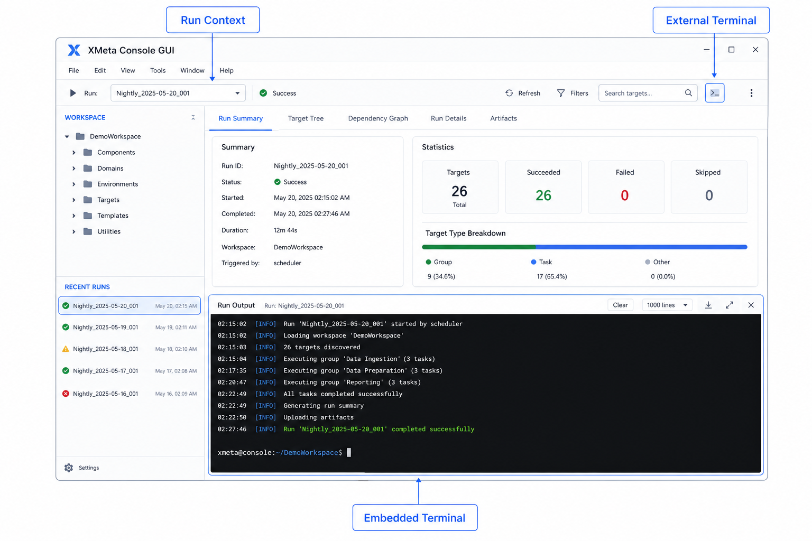

## 13. Status Monitoring And Automatic Refresh

### 13.1 Watched Sources

The runtime watcher tracks:

- Status directory changes.
- Tune file changes.
- Dependency file changes.

### 13.2 Refresh Behavior

- Register and clear watched paths per run.
- Re-register watched files after change events.
- Schedule lightweight refresh for status-only changes.
- Schedule structural rebuild for dependency changes.
- Avoid excessive rebuilds through debounce behavior.
- Protect refresh behavior when runtime observers are paused.

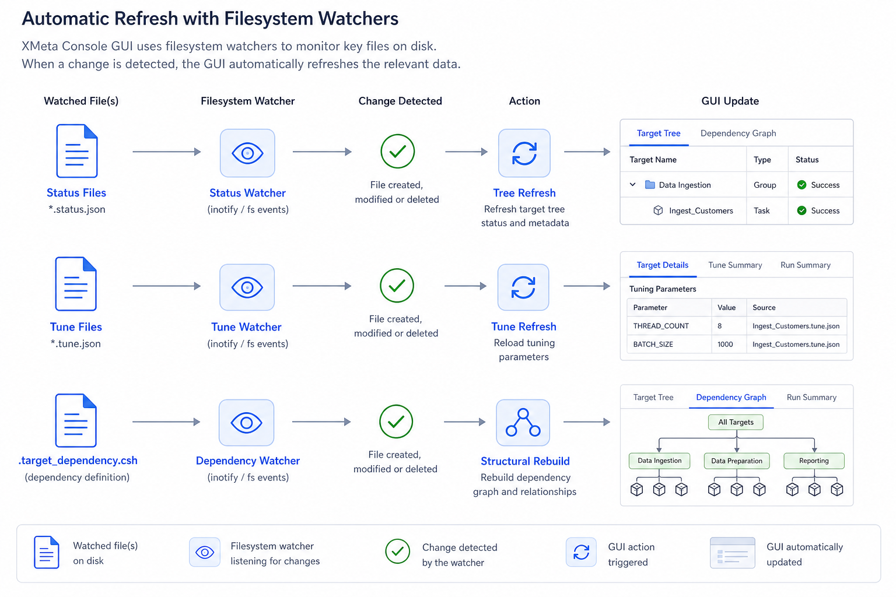

## 14. Themes, Background, And Visual Customization

### 14.1 Theme Controls

The GUI supports light, dark, and high-contrast themes. Users can switch themes from the `View` menu or the configured shortcut.

### 14.2 Visibility Controls

The `Setting` menu provides:

- Column visibility picker.
- Button visibility picker.
- Background color dialog.

Column visibility rules:

- `level` and `target` are mandatory.
- Optional columns can be shown or hidden.
- Hidden columns are excluded from adaptive width calculations.

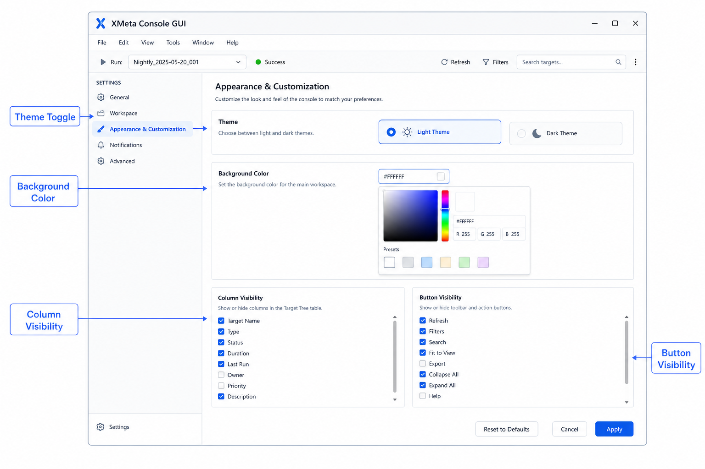

## 15. Notifications, Output, And Logging

### 15.1 Notifications

Toast notifications report success, warning, and error events.

### 15.2 Output Panel

The output panel shows GUI log entries, command output, and background action results.

### 15.3 Runtime Feedback

Background actions can queue action-complete refresh requests on the GUI thread. Output attention stays synchronized with runtime events.


## 16. Menus And Keyboard Shortcuts

### 16.1 Menu Bar

Important menus:

- `Status`: Show All Status.
- `View`: Show Dependency Graph and theme actions.
- `Setting`: Column visibility, button visibility, and background color.
- `Tools`: External Terminal, User Params, and Tile Params.

### 16.2 Keyboard Shortcuts

| Shortcut | Action |
|----------|--------|
| `Ctrl+F` | Focus search field. |
| `Ctrl+R` | Refresh the current view. |
| `Ctrl+E` | Expand all rows. |
| `Ctrl+W` | Collapse all rows. |
| `Ctrl+T` | Toggle theme. |
| `Ctrl+G` | Show dependency graph. |
| `Ctrl+C` | Copy selected target names. |
| `Ctrl+Enter` | Run selected targets. |
| `Ctrl+U` | Trace upstream dependencies. |
| `Ctrl+D` | Trace downstream dependencies. |
| `Ctrl+P` | Open `user.params`. |
| `Ctrl+Shift+P` | Open `tile.params`. |

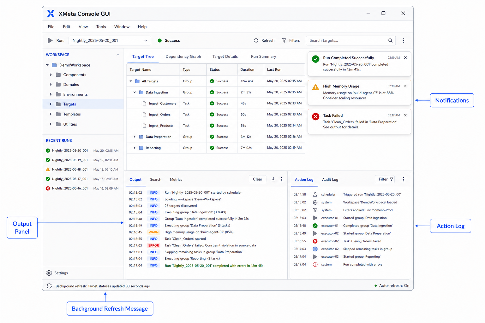

## 17. Common Workflows

### 17.1 Find Failed Targets

1. Select the target run.
2. Open a status-filtered view for failed targets.
3. Inspect target logs or command files.
4. Trace upstream dependencies when the failure may be caused by earlier targets.
5. Use execution actions only after confirming the intended target selection.

### 17.2 Inspect A Dependency Path

1. Select a target in the main tree.
2. Use Trace Up or Trace Down.
3. Switch to dependency graph view if the relationship is easier to understand visually.
4. Use graph search or local focus for large dependency networks.
5. Locate a graph node back in the tree when row-level detail is needed.

### 17.3 Edit Runtime Parameters

1. Open `user.params` from the Tools menu or target context menu.
2. Search for the parameter.
3. Edit the value.
4. Save changes.
5. Use the output panel and notifications to confirm the result.

### 17.4 Update Target Resource Settings

1. Select a target row.
2. Double-click Queue, Cores, or Memory.
3. Enter the new value.
4. Confirm the change.
5. Refresh or monitor automatic status updates after the run action.

## 18. Troubleshooting

### 18.1 No Runs Appear

Check that the run base directory exists and contains run directories. If the directory changed while the GUI was open, refresh the run selector.

### 18.2 Target Tree Is Empty

Check whether `.target_dependency.csh` exists in the selected run and contains active target definitions.

### 18.3 Status Does Not Refresh

Check that status files are being written under `status/`. If the filesystem watcher misses an event, use manual refresh.

### 18.4 Tune Files Are Missing

Check whether tune files follow the expected pattern:

```text
{run_dir}/tune/{target}/{target}.{suffix}.tcl
```

### 18.5 Embedded Terminal Is Unavailable

Embedded terminal support depends on the operating system and terminal backend. Use the external terminal fallback when embedding is not available.

### 18.6 Graph View Looks Out Of Date

Dependency graph data is rebuilt when dependency inputs change. Use refresh if the underlying dependency file changed outside normal watcher timing.

## 19. Developer Notes

### 19.1 Package Boundaries

| Path | Responsibility |
|------|----------------|
| `new_gui/main.py` | PyQt application entry point and `MainWindow` composition surface. |
| `new_gui/presentation/` | Widgets, dialogs, presenters, styles, assets, and theme behavior. |
| `new_gui/presentation/state/` | Window-owned runtime state containers. |
| `new_gui/application/` | Use-case orchestration and action workflow logic. |
| `new_gui/model/services/` | View-state rules, tree-state helpers, transformations, and navigation logic. |
| `new_gui/infrastructure/repositories/` | Filesystem, process, dependency parsing, status, tune, and terminal integration. |
| `new_gui/shared/config/` | Constants, settings, regexes, and logger setup. |

### 19.2 Test And Verification

Run focused tests from the repository root:

```bash
python3 -m pytest tests
```

Manual verification:

1. Launch `python3 new_gui/main.py`.
2. Select a representative run.
3. Confirm the main tree loads targets and statuses.
4. Try search, trace, dependency graph, tune discovery, params tools, and terminal actions.
5. Modify a status or tune file and confirm the GUI refreshes.

## 20. Reference Documents

Use these documents for deeper information:

- `README.md` for the full feature inventory and maintenance notes.
- `docs/architecture_overview.md` for architecture and module ownership.
- `work_scr/new_gui_maintenance_boundaries.md` for maintenance boundaries.
- `work_scr/dependency_graph_closure_checklist.md` for dependency graph closure notes.
